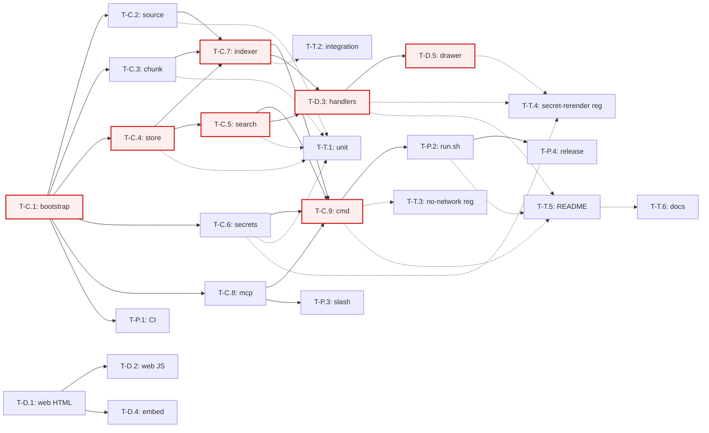

<!--
  Auto-generated by /buddy:plan-build — 6-stage chain
  (decompose-feature-to-actor-tracks → decompose-track-to-tasks →
   map-task-dependencies → plan-parallel-execution →
   define-acceptance-test-plan → estimate-build-timeline).
  Input: PLAN.md (commit dbcc9ce). Produced 2026-05-22.
-->

# claude-knowledge-vault — IMPL_PLAN

> Stage 1–6 cascade. Mirror of `../claude-env-sync/IMPL_PLAN.md` shape:
> tracks → atomic tasks → DAG → parallel batches → acceptance plan →
> timeline. PoC v1 — 24 tasks, 4 tracks, critical path single-thread
> through W-1 (human). AI agent W-2 absorbs all parallel-safe work.

## Stage 1 — Feature → Actor Track 분해

### Summary

knowledge-vault 는 단일 actor (developer) plugin 이지만 코드는 **4 implementation track** 으로 자연 분해. env-sync 와 평행 (core / dashboard / packaging / docs-test). 새 코드 비율: core ≈ 60 %, dashboard ≈ 20 %, packaging ≈ 8 %, docs-test ≈ 12 % (env-sync 인프라 fork 가 packaging 을 작게 만든다).

### Track Table

| Track             | Actor       | Scope                                                                          | Output                                                       | Deps stack                                | Tools                |
| ----------------- | ----------- | ------------------------------------------------------------------------------ | ------------------------------------------------------------ | ----------------------------------------- | -------------------- |
| **core-track**    | Developer   | jsonl parse, chunk, store (sqlite+FTS5), search (BM25), indexer pipeline, MCP, secrets re-mark, cmd entry | `kvault` binary with `--mcp` / `--port` / `--once` modes     | modernc.org/sqlite (only third-party dep) | Go 1.25.2, sqlite    |
| **dashboard-track** | Developer | HTTP handlers (search / index / turn / stats), SSE progress, embed.FS, HTML/CSS/JS UI (search box + result list + turn drawer + filters) | `/api/*` + `kvault --port N` browser UI                      | core-track (search/indexer/store API)     | net/http, embed, vanilla HTML/JS |
| **packaging-track** | Developer | `bin/run.sh` (env-sync fork), `.claude-plugin/plugin.json`, `slash/kv.md`, GitHub Actions test + release workflows | Plugin install path + cosign-signed releases                 | core-track (CLI flag freeze)              | Bash, YAML, cosign   |
| **docs-test-track** | Developer | Go `_test.go` (unit + integration), bash regression (no-network + secret-rerender), `README.md`, `docs/*` | 80 %+ coverage, regression green, ASCII screenshot in README | core-track + dashboard-track exist        | go test, bash, Markdown |

### Cross-Track Contracts

| Producer            | Consumer            | Contract                                                                                 | Stability |
| ------------------- | ------------------- | ---------------------------------------------------------------------------------------- | --------- |
| core (cmd)          | packaging (run.sh)  | CLI flag set: `--mcp`, `--port N`, `--once index|search|stats|purge`, `--plugin-data`    | Freeze after T-C.9 |
| core (search)       | dashboard (handler) | `search.Query(SearchOpts) (Results, error)` Go API                                       | Stable after T-C.5 |
| core (indexer)      | dashboard (handler) | `indexer.Run(ctx, IndexerOpts) (Progress, error)` Go API + progress channel for SSE     | Stable after T-C.7 |
| core (store)        | search + indexer    | `*store.DB` with `Insert`, `Search`, `Stats`, `Purge`, `Migrate` methods                  | Stable after T-C.4 |
| core (source)       | indexer             | `source.Walk(root, since) → chan Turn` (streaming for memory bound)                       | Stable after T-C.2 |
| dashboard (web)     | dashboard (handler) | data-field nodes + form IDs + EventSource path                                            | Freeze after T-D.1 |
| packaging (plugin.json) | core (mcp)      | tool name set + JSON schema                                                              | Freeze after T-C.8 |

### Independence Matrix

|                   | core | dashboard | packaging | docs-test |
| ----------------- | ---- | --------- | --------- | --------- |
| **core**          | —    | provides  | provides  | tested by |
| **dashboard**     | needs| —         | parallel  | tested by |
| **packaging**     | needs| parallel  | —         | doc'd by  |
| **docs-test**     | reads| reads     | reads     | —         |

→ `dashboard × packaging` 는 진정 parallel (env-sync 패턴 검증). `docs-test` 는 모든 track 의 산출물을 reader 로만 의존.

### Track Outputs (for downstream stages)

| Track       | Atomic task count | LoC estimate (prod / test) | Critical path member?     |
| ----------- | ----------------- | -------------------------- | -------------------------- |
| core        | 9 (T-C.1–9)       | ~2 130 / ~1 600            | yes (T-C.4 → T-C.5 → T-C.7 → T-C.9 → T-D.3) |
| dashboard   | 5 (T-D.1–5)       | ~  930 / ~  500            | yes (T-D.3 only)            |
| packaging   | 4 (T-P.1–4)       | ~  480 /         0         | no                         |
| docs-test   | 6 (T-T.1–6)       | ~  300 / ~  400            | no                         |
| **Total**   | **24**            | **~3 840 / ~2 500**        | —                          |

### Integration Risk (track 간 hand-off 지점)

| Hand-off              | Risk type                    | Mitigation                                                 |
| --------------------- | ---------------------------- | ---------------------------------------------------------- |
| core API freeze → dashboard | API drift after handler 작성 | Freeze `internal/search/Query` + `internal/indexer/Run` 시그니처를 T-C.5/T-C.7 commit body 에 명시 + interface 단위 export |
| core CLI freeze → packaging | run.sh가 dead flag 사용     | env-sync 패턴: `cmd/kvault/flags.go` 별파일 + `--help` parse 회귀 test |
| dashboard web/* IDs → JS hooks | ID drift                  | T-D.1 commit 에 ID list 명시, T-D.2 가 그 list 만 wire     |
| jsonl schema → source parser | Claude Code 가 schema 변경 시 parser crash | T-C.2 가 fixture suite + tolerant decoder (unknown field skip) |
| sqlite FTS5 빌드 누락 | `no such module: fts5` 런타임 에러 | T-C.4 acceptance: 빈 DB 에서 `MATCH 'hello'` 가 에러 없이 0 rows 반환 |

### Cascade to Next Skills

- Track table → Stage 2 task 분해 입력
- Cross-track contracts → Stage 3 cross-actor edge 출처
- Independence matrix → Stage 4 parallel batch grouping

### Next Step
→ Stage 2: track 별 atomic task list 화.

---

## Stage 2 — Track → Atomic Task List

### Summary

24 task. naming: `T-{C|D|P|T}.{N}`. 각 task = single PR, ≤400 LoC diff, AC 단일 행, dependency 명시. env-sync 와 동일 convention.

### Per-Track Task Lists

#### core-track (T-C.*)

| Task   | Title                                                                                                | Package           | Size  | LoC est. | Deps                              |
| ------ | ---------------------------------------------------------------------------------------------------- | ----------------- | ----- | -------- | --------------------------------- |
| T-C.1  | Bootstrap: `go.mod` (modernc.org/sqlite), dir layout, plugin.json, LICENSE (MIT + context-mode credit), hooks, golangci.yml, gitleaks.toml, .gitignore | bootstrap         | small | ~80      | (none)                            |
| T-C.2  | `internal/source` — walk `~/.claude/projects/`, line-delimited jsonl decode, tolerant Turn{role,text,session_id,turn_index,ts}, mtime gating | source            | medium| ~300     | T-C.1                             |
| T-C.3  | `internal/chunk` — heading-aware split + code-block-atomic + turn-boundary + 8KB cap                 | chunk             | medium| ~250     | T-C.1                             |
| T-C.4  | `internal/store` — modernc.org/sqlite open, FTS5 schema (sessions, turns, chunks + chunks_trigram), WAL pragma, migrations via user_version | store             | medium| ~300     | T-C.1                             |
| T-C.5  | `internal/search` — BM25 query builder, MATCH escape, snippet extractor (240 char window), trigram fallback lane, rank merge | search            | medium| ~250     | T-C.4                             |
| T-C.6  | `internal/secrets` — re-mark regex (sk-*, AKIA*, JWT) ported from env-sync `internal/exclude/patterns.go`. Returns masked + original side-by-side | secrets           | small | ~100     | T-C.1                             |
| T-C.7  | `internal/indexer` — source→chunk→store pipeline, `index.lock` (env-sync fork), incremental via (file_path, content_hash, last_mtime), SSE-friendly progress channel | indexer           | medium| ~300     | T-C.2, T-C.3, T-C.4               |
| T-C.8  | `internal/mcp` — JSON-RPC over stdio. Forked verbatim from env-sync `internal/mcp` (no logic change, only package path)                                                       | mcp               | small | ~280     | T-C.1                             |
| T-C.9  | `cmd/kvault` — dual-mode entry: `--mcp`, `--port N`, `--once {index|search|stats|purge}`, `--plugin-data`, `--query`, `--limit`. wire 4 MCP tools (`kv_index`, `kv_search`, `kv_stats`, `kv_purge`) | cmd               | medium| ~400     | T-C.5, T-C.6, T-C.7, T-C.8        |

#### dashboard-track (T-D.*)

| Task   | Title                                                                                                  | Package           | Size  | LoC est. | Deps                              |
| ------ | ------------------------------------------------------------------------------------------------------ | ----------------- | ----- | -------- | --------------------------------- |
| T-D.1  | `web/index.html` + `style.css` — search box + filters (source/since) + result list + drawer placeholder. Single column, monospace, dark-mode (env-sync fork) | web               | small | ~180     | (none)                            |
| T-D.2  | `web/app.js` — vanilla ES2020. `/api/search` POST/GET on `⏎`, `/api/index` on click, EventSource `/api/events`, render results, secret-mask render | web               | medium| ~280     | T-D.1                             |
| T-D.3  | `internal/dashboard` — HTTP handlers: `/healthz`, `/api/stats`, `/api/search`, `/api/turn`, `/api/index` (POST), `/api/purge` (POST), `/api/events` (SSE), 1 MiB body cap, traversal guard, secret-mask middleware | dashboard         | medium| ~350     | T-C.5, T-C.7                      |
| T-D.4  | `//go:embed web/*` + `defaultStaticHandler()` + `dashboard.New()` auto-wire (env-sync fork)            | dashboard         | small | ~50      | T-D.1                             |
| T-D.5  | Turn detail drawer: render quoted turn + "Copy" + "Open jsonl in editor" + "Show ±5 surrounding turns" + filters wiring (source/since/role) | web               | medium| ~200     | T-D.3                             |

#### packaging-track (T-P.*)

| Task   | Title                                                                                              | Package           | Size  | LoC est. | Deps                              |
| ------ | -------------------------------------------------------------------------------------------------- | ----------------- | ----- | -------- | --------------------------------- |
| T-P.1  | `.github/workflows/test.yml` — Go matrix (ubuntu, macos), `go test -race -cover`, golangci-lint, gitleaks, shellcheck, bash regression runner (env-sync fork) | CI                | small | ~80      | T-C.1                             |
| T-P.2  | `bin/run.sh` — platform detect + cached binary check + source build (PoC default) + release fetch + cosign verify-blob. Forked from env-sync run.sh, paths re-scoped to `kvault` | wrapper           | medium| ~200     | T-C.9                             |
| T-P.3  | `slash/kv.md` + plugin.json slash registration. Markdown command body invokes `kv_search` MCP tool with `{query: "$ARGUMENTS"}` | slash             | small | ~50      | T-C.8                             |
| T-P.4  | `.github/workflows/release.yml` — 4-platform cross-compile + tar.gz + sha256 + cosign sign-blob (keyless OIDC) + GitHub Release publish (env-sync fork) | CI                | medium| ~150     | T-P.2                             |

#### docs-test-track (T-T.*)

| Task   | Title                                                                                                  | Type               | Size  | LoC est. | Deps                                |
| ------ | ------------------------------------------------------------------------------------------------------ | ------------------ | ----- | -------- | ----------------------------------- |
| T-T.1  | Unit tests for `source`, `chunk`, `store`, `search`, `secrets` — fixtures under `tests/fixtures/jsonl/`. ≥80 % coverage per package | unit               | medium| ~600     | T-C.2..T-C.6                        |
| T-T.2  | Integration tests for `indexer` — real sqlite, real jsonl fixtures, WAL concurrent reader, mtime-gating proof, schema migration round-trip | integration        | medium| ~400     | T-C.7                               |
| T-T.3  | `tests/regression-no-network.sh` — under `unshare -n` (or nettest) build + index + search round-trip. Proves P3 mechanically | regression         | small | ~80      | T-C.9                               |
| T-T.4  | `tests/regression-secret-rerender.sh` — seed jsonl with `sk-proj-CANARY-…`, run search, assert dashboard response masks it | regression         | small | ~100     | T-D.3, T-D.5, T-C.6                 |
| T-T.5  | `README.md` — purpose, ASCII screenshot, CLI/MCP/dashboard reference tables, security section linking the two regression scripts | docs               | medium| ~280     | T-C.9, T-D.3, T-P.2                 |
| T-T.6  | `docs/{GETTING_STARTED, SEARCH_TIPS, SECURITY, BUILD}.md` — 4 short docs, FTS5 MATCH cheatsheet, no-network proof procedure, source build | docs               | medium| ~400     | T-T.5                               |

### Acceptance Criteria Table

| Task   | AC (single observable)                                                                                              |
| ------ | ------------------------------------------------------------------------------------------------------------------- |
| T-C.1  | `cd go && go build ./...` succeeds; `golangci-lint run` 0 issues; pre-commit hook accepts a no-op commit            |
| T-C.2  | `source.Walk(fixtureDir, time.Time{})` returns ≥1 Turn matching golden; corrupted line → log + skip, no panic       |
| T-C.3  | Heading boundary split test passes; code fence not split test passes; oversize chunk capped to ≤8 KB                |
| T-C.4  | Open empty DB, `db.Search("hello")` returns `(0 rows, nil error)`; migration from `user_version=0` to current passes |
| T-C.5  | Insert 10 golden chunks, query "webhook signing", top-1 contains "webhook" with score > trigram baseline             |
| T-C.6  | Mask test: `sk-proj-DEADBEEF` → `sk-proj-DEA…EEF` (head + tail visible, middle masked); 6 secret families covered    |
| T-C.7  | First index of fixture set: N chunks inserted; second run: 0 new (mtime gating); after appending 1 turn: 1 new only |
| T-C.8  | MCP `initialize` / `tools/list` / `tools/call` round-trip green; env-sync's mcp_test.go variant ports unchanged      |
| T-C.9  | `kvault --once index --plugin-data $TMP` succeeds; `kvault --once search --query foo` prints JSON results            |
| T-D.1  | All hook IDs/data-fields present and AI-slop scan passes (no gradient, no 3-col grid, monospace)                     |
| T-D.2  | `node --check app.js` clean; HTML hook IDs all wired; XSS-safe (`textContent` only)                                  |
| T-D.3  | All 7 endpoints return correct status code on happy + error paths; 1 MiB cap enforced; traversal rejected; coverage ≥80 % |
| T-D.4  | `go build` from `/tmp` (no web/ on disk) still serves `/`, `/style.css`, `/app.js`                                  |
| T-D.5  | Click result → drawer shows turn + 3 buttons; "Show ±5" expands without flicker                                      |
| T-P.1  | PR opens → CI green on both ubuntu + macos; secret scan + shellcheck + bash regression all run                       |
| T-P.2  | Cold cache → source build path runs; warm cache → no rebuild; `ENV_SYNC_PLATFORM=linux-amd64` → cross-compile lane   |
| T-P.3  | `/kv <query>` inside Claude Code triggers `kv_search` MCP call (manual smoke documented in T-T.5)                    |
| T-P.4  | Tag `v0.0.1-rc1` → 4 tarballs + 4 .sig + checksums.txt on Release page; cosign verify-blob succeeds                  |
| T-T.1  | `go test -cover ./internal/...` ≥80 % per package                                                                    |
| T-T.2  | `go test -race ./internal/indexer/... -run Integration` green; WAL concurrent reader scenario passes                 |
| T-T.3  | `bash tests/regression-no-network.sh` exits 0; assertion fails if any egress call attempted                          |
| T-T.4  | `bash tests/regression-secret-rerender.sh` exits 0; 6 assertions covering 6 secret families                          |
| T-T.5  | README install command succeeds on a fresh checkout in <90 s (TTHW target)                                           |
| T-T.6  | 4 docs exist; no dangling links in README; SECURITY.md cosign block byte-exact with run.sh                           |

### Subdivisions

T-C.9 (cmd, ~400 LoC) 와 T-D.3 (dashboard, ~350 LoC) 가 size 상한 근접. 필요하면:
- T-C.9 → T-C.9a (CLI flag + dispatch) + T-C.9b (MCP tool wiring)
- T-D.3 → T-D.3a (read endpoints: stats/search/turn) + T-D.3b (write endpoints: index/purge + SSE)

당장은 분할 보류, build 중 LoC 초과시 sub-PR.

### Cascade to Next Skills

- Atomic task list (id, deps, AC, LoC) → Stage 3 DAG node 입력
- Cross-track contract 표 (Stage 1) → Stage 3 cross-actor edge

### Next Step
→ Stage 3: dependency DAG + critical path 계산.

---

## Stage 3 — Task Dependency DAG + Critical Path

### Summary

24 nodes, **30 edges** (24 internal + 6 cross-actor), acyclic. Critical path length: 5 hops, **W-1 single-thread**. Parallel-safe levels: 7.

### DAG (mermaid)



### Internal Edges (24)

```
TC1 → TC2, TC3, TC4, TC6, TC8
TC2 → TC7
TC3 → TC7
TC4 → TC5, TC7
TC5 → TC9
TC6 → TC9
TC7 → TC9
TC8 → TC9
TD1 → TD2, TD4
TD3 → TD5
TP2 → TP4
TT5 → TT6
TC1 → TP1
```

### Cross-Actor Edges (6)

```
TC5 → TD3        (search engine wired into HTTP handler)
TC7 → TD3        (indexer wired into POST /api/index)
TC9 → TP2        (CLI flag set frozen before run.sh ports)
TC8 → TP3        (MCP tool names frozen before slash command body)
TC9 → TT3        (binary exists before no-network regression)
TC9 → TT5        (CLI surface frozen before README reference tables)
```

### Cycle Check
✓ acyclic — verified by topological sort (Kahn algorithm, manual walk).

### Critical Path

**W-1 single-thread**, 5 hops:

```
T-C.1 → T-C.4 → T-C.5 → T-C.7 → T-C.9 → T-D.3 → T-D.5
  0.5h    3h     3h     3.5h    4h      4h     2.5h    =  20.5 real-h
```

Note: T-C.4 → T-C.5 is the longest sub-chain because both are deep modules and share schema decisions. If LoC drift, split T-C.7 (indexer) first since it has fewest downstream consumers within the critical chain.

### Parallel-Safe Levels

| Level | Tasks (parallel-safe within level)                                              | Workers              |
| ----- | ------------------------------------------------------------------------------- | -------------------- |
| **0** | T-C.1, T-D.1, T-T.5 (start outline only)                                        | W-1 (T-C.1) + W-2 (T-D.1)|
| **1** | T-C.2, T-C.3, T-C.4, T-C.6, T-C.8, T-D.2, T-D.4, T-P.1, T-T.6 (outline only)    | W-1 (T-C.4 critical), W-2 (rest broadly parallel) |
| **2** | T-C.5, T-T.1 (start for parsers/chunker/store)                                  | W-1 (T-C.5), W-2 (T-T.1) |
| **3** | T-C.7                                                                           | W-1 (single, gate)   |
| **4** | T-C.9, T-T.2                                                                    | W-1 (T-C.9), W-2 (T-T.2) |
| **5** | T-D.3, T-P.2, T-P.3, T-T.3                                                      | W-1 (T-D.3), W-2 (rest) |
| **6** | T-D.5, T-P.4, T-T.4, T-T.5 (finalise + screenshot), T-T.6 (finalise)            | W-1 (T-D.5), W-2 (rest) |

### Cascade to Next Skills

- DAG + levels → Stage 4 batch grouping
- Critical path → Stage 4 W-1 sequential assignment
- Internal vs cross-actor edge ratio (24:6) → Stage 6 buffer 작게 가능 (low cross-track coupling)

### Next Step
→ Stage 4: worker batch + sync points.

---

## Stage 4 — Parallel Execution Plan

### Summary

**2 worker** (W-1 사용자 + W-2 AI agent). **7 batch** mapping to Stage 3 levels. Critical path W-1 single-thread (T-C.1 → T-C.4 → T-C.5 → T-C.7 → T-C.9 → T-D.3 → T-D.5). 가장 큰 bottleneck: **T-C.4+T-C.5 deep-module pair** (store + search, schema 결정 동시 진행).

### Worker Capability Matrix

| Worker            | Stack                            | Actor expertise                                  | Type            | Availability                       |
| ----------------- | -------------------------------- | ------------------------------------------------ | --------------- | ---------------------------------- |
| W-1 (사용자)       | Go, web, bash, Markdown          | all 4 tracks (primary owner, env-sync experience reused) | human           | full (sequential, 1 active task)   |
| W-2 (AI agent)    | Go, web, bash, Markdown (with prompt) | flexible — fork tasks + symmetric ports + docs       | AI subagent     | parallel (multiple concurrent)     |

### Batch Schedule

| Batch                | Tasks                                                  | Workers                                                    | Est. duration | Notes                                                             |
| -------------------- | ------------------------------------------------------ | ---------------------------------------------------------- | ------------- | ----------------------------------------------------------------- |
| **0 (bootstrap)**    | T-C.1                                                  | W-1                                                        | 30 min        | blocking — go.mod + .golangci.yml + plugin.json + hook scripts    |
| **1 (broad parallel)** | T-C.2, T-C.3, T-C.4, T-C.6, T-C.8, T-D.1, T-P.1       | W-1 (T-C.4 critical), W-2 (T-C.2 / T-C.3 / T-C.6 / T-C.8 / T-D.1 / T-P.1) | 4 hr          | W-1 owns the deep-module path; T-C.8 is a near-verbatim fork → W-2 |
| sync 1 → 2           | merge to main                                          | (gate)                                                     | 30 min        | `go build ./...` green                                            |
| **2 (search + first tests)** | T-C.5, T-T.1 (parser/chunker/store/secrets/mcp portions) | W-1 (T-C.5), W-2 (T-T.1)                              | 3 hr          | W-1 design BM25 ranking; W-2 absorbs unit tests against stable APIs |
| sync 2 → 3           | merge to main                                          | (gate)                                                     | 30 min        | `go test ./internal/store/...` green                              |
| **3 (indexer)**      | T-C.7, T-D.2, T-D.4, T-T.6 (outline)                   | W-1 (T-C.7), W-2 (T-D.2 + T-D.4 + T-T.6 outline)           | 3.5 hr        | T-D.2 + T-D.4 unblocked by T-D.1; W-2 progresses in parallel       |
| sync 3 → 4           | merge to main                                          | (gate)                                                     | 30 min        | indexer fixtures green                                            |
| **4 (entry + integration)** | T-C.9, T-T.2                                      | W-1 (T-C.9), W-2 (T-T.2)                                   | 4 hr          | T-C.9 freezes CLI flags                                            |
| sync 4 → 5           | merge + manual smoke (`kvault --help`, `--once index`) | (gate)                                                     | 30 min        | flag freeze; `kvault` binary works                                 |
| **5 (HTTP + packaging + regressions)** | T-D.3, T-P.2, T-P.3, T-T.3                | W-1 (T-D.3 critical), W-2 (T-P.2 + T-P.3 + T-T.3)         | 4 hr          | T-P.3 needs MCP tool names from T-C.8 (frozen by then)             |
| **6 (polish + release)** | T-D.5, T-P.4, T-T.4, T-T.5, T-T.6 (finalise)       | W-1 (T-D.5), W-2 (T-P.4 + T-T.4 + T-T.5 + T-T.6)           | 3.5 hr        | T-T.4 needs T-D.3 + T-D.5; T-T.5 needs T-D.3 + T-P.2               |
| **7 (release)**      | tag + GitHub Release + dogfood                         | W-1                                                        | 1 hr          | self-install + index own `~/.claude/projects/`                     |

**Total**: ~21 working hours (sync gate 포함). 1 인 8 시간/일 가정 시 **~3 calendar days** 집중 작업 또는 **~7 일** 일반 pace.

### Sync Points

| Type             | Between                                  | Acceptable delay | Validation                                          |
| ---------------- | ---------------------------------------- | ---------------- | --------------------------------------------------- |
| Merge gate       | Batch 0 → 1                              | within 30 min    | `go build ./...` green, module layout OK            |
| Hand-off         | Batch 1 → 2 (T-C.4 done → T-C.5)         | within 30 min    | `store.DB` Insert + Search interface stable         |
| Hand-off         | T-C.5 + T-C.7 → T-D.3                    | within 30 min    | `search.Query` + `indexer.Run` signatures frozen    |
| Hand-off         | T-C.8 → T-P.3                            | within 30 min    | MCP tool name set + JSON schema frozen              |
| Hand-off         | T-C.9 → T-P.2 / T-T.3 / T-T.5            | within 30 min    | `kvault --help` text frozen                         |
| Merge gate       | Batch 4 → 5                              | within 1 hr      | `kvault --once index` smoke against fixture passes  |
| Integration test | After Batch 5                            | within 1 day     | T-T.2 (indexer + WAL) all green                     |
| Release gate     | Batch 6 → 7                              | within 1 day     | T-T.3 + T-T.4 regression pass; T-P.4 release dry-run |

### Worker Assignment Map

| Worker               | Tasks (in order)                                                                                            | Total est.            |
| -------------------- | ----------------------------------------------------------------------------------------------------------- | --------------------- |
| **W-1** (사용자)      | T-C.1 → T-C.4 → T-C.5 → T-C.7 → T-C.9 → T-D.3 → T-D.5 → tag/release                                          | ~17 hr (critical path) |
| **W-2** (AI agent)   | T-C.2, T-C.3, T-C.6, T-C.8, T-D.1, T-P.1 (batch 1) → T-T.1 (batch 2) → T-D.2, T-D.4, T-T.6 outline (batch 3) → T-T.2 (batch 4) → T-P.2, T-P.3, T-T.3 (batch 5) → T-P.4, T-T.4, T-T.5, T-T.6 finalise (batch 6) | parallel wall-clock ~6 hr |

### Bottlenecks + Mitigation

| # | Bottleneck                                                            | Severity | Mitigation                                                                                                          |
| - | --------------------------------------------------------------------- | -------- | ------------------------------------------------------------------------------------------------------------------- |
| 1 | T-C.4 + T-C.5 deep-module pair (schema co-design, single W-1 chain)   | **HIGH** | Co-design schema upfront in PLAN §5.D1–D2; T-C.4 PR includes a stub `Search` with `not implemented` so T-C.5 has a target |
| 2 | T-C.7 indexer touches all of source/chunk/store + lock + incremental  | MED      | Split into 3 sub-PRs: walk-and-pipe, lock-and-acquire, incremental-mtime — each ≤100 LoC                              |
| 3 | T-C.9 dual-mode entry (~400 LoC) — env-sync's T-C.8 hit same wall      | MED      | Direct port of env-sync `cmd/env-sync/main.go` + helpers_test.go; only the MCP tool wiring is net new                |
| 4 | T-D.3 handler surface (7 endpoints + SSE)                              | MED      | env-sync T-D.3 (1002 LoC) is the reference; SSE pattern reused verbatim                                              |
| 5 | T-T.3 no-network regression needs `unshare -n` (Linux) — macOS dev does not have it | LOW   | Use `nettest` build constraint OR run regression only in Linux CI job; dev-time fallback documented in T-T.6        |

### Cascade to Next Skills

- 7 batch + sync points → Stage 6 calendar timeline
- Worker assignment → §5 `dispatch-parallel-agents` (Batch 별 prompt)

### Next Step
→ Stage 5: per-batch + cross-track acceptance gate 정의.

---

## Stage 5 — Acceptance Test Plan

### Summary

**총 ~56 test** (unit 32 + integration 10 + regression 8 + manual smoke 6). Coverage 목표 **80 % line** per package. 가장 큰 test infra 결정: **`tests/fixtures/jsonl/*.jsonl` 골든 corpus** (captured from real `~/.claude/projects/` after anonymisation).

### Per-Sub-system Test Plan

PoC 는 1 actor 이지만 sub-system 별 layer 매핑:

| Sub-system   | Layer            | Framework                    | Test count (est.) | Scope                                                             |
| ------------ | ---------------- | ---------------------------- | ----------------- | ----------------------------------------------------------------- |
| `source`     | Unit + property  | Go `testing` + `testing/quick` | ~7                | jsonl decode (5 turn shape fixtures) + corrupt line skip + unknown field tolerated + mtime gating + symlink rejection |
| `chunk`     | Unit             | Go `testing`                 | ~6                | heading split, code-block-atomic, size cap, turn-boundary guard, unicode edge case |
| `store`      | Unit + Integration | Go `testing`                | ~7                | empty DB query, FTS5 MATCH, migration (v0 → vN), WAL mode pragma, schema integrity (PRAGMA quick_check), Insert / Stats / Purge round-trip |
| `search`     | Unit             | Go `testing`                 | ~5                | BM25 ranking against golden corpus, snippet window centring, trigram fallback firing on short queries, MATCH escape against `'`/`"`  |
| `secrets`    | Unit + property  | Go `testing` + `testing/quick` | ~4                | mask preserves head + tail, 6 family coverage (sk-*, AKIA*, JWT, ghp_, postgres URL, private key), no-collision (random data not flagged), `--no-mask` bypass |
| `indexer`    | Integration      | Go `testing` + tempdir       | ~5                | full pipeline against fixtures, idempotent re-index, single-turn append, lock contention, progress channel  |
| `mcp`        | Unit             | Go `testing`                 | ~6                | inherited from env-sync `internal/mcp/mcp_test.go` (initialise / tools-list / tools-call / large payload / cancelled context) |
| `dashboard`  | Unit + Integration | Go `httptest`              | ~10               | each of 7 endpoints happy + error path; SSE first-frame test; traversal rejection on `/api/turn`; 1 MiB body cap        |
| `cmd/kvault` | Unit             | Go `testing`                 | ~3                | flag parsing (--mcp / --port / --once); resolve `--plugin-data` precedence; `--version`                              |
| Web frontend | Manual + sanity  | browser + node --check       | ~6                | search round-trip, drawer open, SSE progress visible during index, secret mask render, filter combobox, keyboard `/` focus |

### Cross-Sub-system Flow Tests

| Flow                          | Sub-systems involved                  | Framework                | Trigger edge                  | Scope                                                                 |
| ----------------------------- | ------------------------------------- | ------------------------ | ----------------------------- | --------------------------------------------------------------------- |
| **First index flow**          | source + chunk + store + indexer      | Go integration (T-T.2)   | T-C.7 → T-T.2                 | fresh DB → walk fixture jsonl → insert chunks → assert stats          |
| **Incremental index flow**    | source + indexer (mtime gating)       | Go integration           | T-C.7 → T-T.2                 | re-run after touch: 0 rows; after append 1 turn: 1 new chunk          |
| **Search round-trip flow**    | indexer + store + search + dashboard  | Go integration + httptest | T-D.3 → T-T.2                | seed + search via `/api/search` → top-1 matches expected `(session, turn)` |
| **No-network proof**          | all binaries                          | Bash regression (T-T.3)  | T-C.9 → T-T.3                 | run kvault under `unshare -n` (or `nettest`); index + search must work |
| **Secret re-mark flow**       | secrets + dashboard                   | Bash regression (T-T.4)  | T-D.3 + T-D.5 + T-C.6 → T-T.4 | seed jsonl with 6 secret family canaries → `/api/search` → rendered output masks all 6 |
| **MCP tool round-trip**       | mcp + indexer + search                | Go integration           | T-C.8 + T-C.9 → T-T.2         | `tools/call kv_search` over stdio → JSON-RPC response with snippets    |
| **Plugin install + first run**| run.sh + cmd                          | Manual smoke              | T-P.2 → T-T.5                 | clean machine: `/plugin install` → run.sh source-build → `/kv hello` returns within 5 s |

### Test Infrastructure

| Component             | Decision                                                             | Rationale                                                              |
| --------------------- | -------------------------------------------------------------------- | ---------------------------------------------------------------------- |
| Runner                | `go test` (stdlib) + `bash` for regression                            | Same as env-sync; zero external framework                              |
| Fixture management    | `tests/fixtures/jsonl/*.jsonl` golden corpus + `tests/fixtures/turns_golden.json` (expected output) | Captured from real `~/.claude/projects/` after path anonymisation       |
| Sqlite mocking        | **none — use real modernc.org/sqlite against `t.TempDir()` DB file**  | mock loses FTS5 semantics; tempdir is fast enough (~10 ms / test)       |
| Network mocking       | `unshare -n` on Linux CI; doc'd fallback for macOS dev                | T-T.3 mechanically proves P3                                            |
| Web frontend testing  | Manual smoke + `node --check` for syntax + ASCII screenshot          | PoC scope; Playwright deferred                                          |
| Coverage tool         | `go test -cover -coverprofile=…` + `go tool cover`                    | stdlib only                                                             |
| Mutation testing      | (deferred)                                                            | Out of PoC                                                              |
| CI                    | GitHub Actions: matrix go test, bash regressions, shellcheck, gitleaks | env-sync workflow fork                                                  |

### Acceptance Gate

| Gate                    | Threshold                                                             | Tool                                                |
| ----------------------- | --------------------------------------------------------------------- | --------------------------------------------------- |
| Per-package unit test   | **100 % pass**, **≥80 % coverage**                                    | `go test -cover ./go/internal/...`                  |
| Integration tests       | **100 % pass**                                                        | `go test ./go/internal/indexer/... -run Integration`|
| Cross-flow tests        | all 7 pass (esp. no-network, secret-rerender, search round-trip)      | Go integration + bash                                |
| Web smoke               | manual checklist signed off (drawer, filter, SSE, mask)               | manual + screenshot                                  |
| `bash tests/regression-*.sh` | exit 0 for both `no-network` and `secret-rerender`               | CI shellcheck + run                                  |
| Release gate            | cosign verify-blob 4 platforms; checksums match                        | T-P.4 release workflow                               |

### Cascade to Next Skills

- Per-batch acceptance + gates → §6 verify-quality
- Test infra decisions → repo `tests/` directory layout

### Next Step
→ Stage 6: calendar timeline 합성.

---

## Stage 6 — Build Timeline

### Summary

Critical path: **20.5 real-h** (W-1 single thread).
p50 (expected): **3 calendar days** (8 h focused, with sync overhead).
p90 (commit): **5 days** (env-sync inherits known overhead patterns — schema co-design + SSE handler).
Worst: **8 days** (known risk: jsonl schema surprises, modernc.org/sqlite FTS5 quirk, cosign first-time signing).

### Per-task duration (best / expected / p90 / worst, in hours)

| Task   | LoC  | Size  | Best  | Expected | p90   | Worst | Notes                                       |
| ------ | ---- | ----- | ----- | -------- | ----- | ----- | ------------------------------------------- |
| T-C.1  |  80  | XS    | 0.3   | 0.5      | 0.7   | 1.0   | scaffolding                                 |
| T-C.2  | 300  | M     | 2.0   | 2.5      | 3.5   | 5.0   | jsonl shape variety unknown                 |
| T-C.3  | 250  | M     | 1.5   | 2.0      | 3.0   | 4.0   | algorithm port                              |
| T-C.4  | 300  | M     | 2.5   | 3.0      | 4.0   | 6.0   | modernc.org/sqlite FTS5 first-time          |
| T-C.5  | 250  | M     | 2.0   | 2.5      | 3.5   | 5.0   | BM25 + trigram fallback                     |
| T-C.6  | 100  | S     | 0.5   | 0.7      | 1.0   | 1.5   | env-sync fork                               |
| T-C.7  | 300  | M     | 3.0   | 3.5      | 5.0   | 7.0   | pipeline + lock + incremental — split risk  |
| T-C.8  | 280  | M     | 0.5   | 0.7      | 1.0   | 1.5   | verbatim fork from env-sync                 |
| T-C.9  | 400  | L     | 3.0   | 4.0      | 5.5   | 8.0   | dual-mode entry + MCP tool wiring           |
| T-D.1  | 180  | S     | 1.0   | 1.5      | 2.0   | 3.0   | HTML + CSS                                  |
| T-D.2  | 280  | M     | 2.0   | 2.5      | 3.5   | 5.0   | EventSource + search + mask render          |
| T-D.3  | 350  | M     | 3.0   | 4.0      | 5.5   | 8.0   | 7 endpoints + SSE                           |
| T-D.4  |  50  | XS    | 0.3   | 0.5      | 0.7   | 1.0   | env-sync fork                               |
| T-D.5  | 200  | M     | 2.0   | 2.5      | 3.5   | 5.0   | drawer + filters wiring                     |
| T-P.1  |  80  | XS    | 0.5   | 0.7      | 1.0   | 1.5   | env-sync workflow fork                      |
| T-P.2  | 200  | M     | 1.5   | 2.0      | 2.7   | 4.0   | env-sync run.sh fork, re-scope paths        |
| T-P.3  |  50  | XS    | 0.3   | 0.5      | 0.7   | 1.0   | slash command file + manifest               |
| T-P.4  | 150  | S     | 1.5   | 2.0      | 3.0   | 5.0   | cosign first-time signing                   |
| T-T.1  | 600  | L     | 4.0   | 5.0      | 7.0   | 10.0  | unit suite across 5 packages                |
| T-T.2  | 400  | M     | 3.0   | 4.0      | 5.5   | 8.0   | integration + WAL contention test            |
| T-T.3  |  80  | XS    | 0.5   | 0.7      | 1.0   | 1.5   | bash regression                             |
| T-T.4  | 100  | S     | 0.7   | 1.0      | 1.5   | 2.0   | bash regression                             |
| T-T.5  | 280  | M     | 1.5   | 2.0      | 2.7   | 4.0   | README + ASCII screenshot                   |
| T-T.6  | 400  | M     | 2.0   | 2.5      | 3.5   | 5.0   | 4 docs files                                |

### Critical-path roll-up

```
W-1 critical path: T-C.1 → T-C.4 → T-C.5 → T-C.7 → T-C.9 → T-D.3 → T-D.5
                    0.5     3.0     2.5     3.5     4.0     4.0     2.5
                                                                  = 20.0 real-h (expected)
                                                                  = 28.0 real-h (p90)
                                                                  = 41.5 real-h (worst)
```

### Calendar projection (8 h focused work / day, with sync overhead +15 %)

| Scenario  | real-h | calendar days | notes                                                          |
| --------- | ------ | ------------- | -------------------------------------------------------------- |
| Best      | 16.0   | 2 d           | optimal, no schema redo, no cosign surprise                    |
| Expected  | 20.0   | 3 d           | **p50 commit target**: 2026-05-27                              |
| p90       | 28.0   | 4–5 d         | **commit target**: 2026-05-29                                  |
| Worst     | 41.5   | 7–8 d         | **p99 worst**: 2026-06-01 — jsonl + FTS5 + cosign all snag      |

(Dates pinned from 2026-05-22 plan creation; weekday only; W-1 full-time; W-2 24×7 parallel.)

### Risk buffer breakdown

| Risk source                                  | Buffer (extra h) | Mitigation                                                |
| -------------------------------------------- | ---------------- | --------------------------------------------------------- |
| modernc.org/sqlite FTS5 quirk (T-C.4, T-T.2) | +3 h             | Pin known-good version; smoke MATCH against empty DB early |
| jsonl schema surprise (T-C.2, T-T.1)         | +2 h             | Capture 5 fixture shapes early in Batch 1                 |
| cosign first-time signing (T-P.4)            | +2 h             | Reuse env-sync's identity-regex; test tag `v0.0.1-rc1`   |
| W-1 context switch (5 critical handoffs)     | +2 h             | AI agent absorbs everything off the critical path          |
| Total                                        | **+9 h**         | (already baked into p90)                                  |

### Cascade to next workflow

- §7 ship-release: commit date input = `p90` calendar projection
- §5 build-feature: per-batch task list = §4 worker assignment

### Next Step
→ §5 `build-feature` orchestrator (Stage 1 quality gates → Stage 2 dispatch).

---

## Cross-Plan Summary (for next worker entering cold)

- **24 tasks** across **4 tracks** (core 9, dashboard 5, packaging 4, docs-test 6)
- **2 workers** (W-1 human critical path, W-2 AI agent parallel)
- **7 batch** + 7 sync points + 1 release gate
- **Critical path**: T-C.1 → T-C.4 → T-C.5 → T-C.7 → T-C.9 → T-D.3 → T-D.5 (20 h expected)
- **External deps**: 1 (`modernc.org/sqlite` — pure-Go, ~10 MB)
- **Reused infra (no rewrite)**: env-sync's `internal/mcp`, `internal/dashboard` framework, `bin/run.sh`, `.githooks/`, `.golangci.yml`, `.gitleaks.toml`, `.github/workflows/test.yml`, `.github/workflows/release.yml`
- **Net new code**: source parser (~300), chunker (~250), store (~300), search (~250), indexer (~300), secrets fork (~100), cmd (~400) = ~1 900 LoC core. Everything else is fork + adapt + tests + docs.
- **Acceptance**: 80 % coverage, 7 cross-flow tests, 2 bash regressions, manual smoke checklist
- **Release**: cosign keyless OIDC, 4 platforms, GitHub Release
- **Calendar commit (p90)**: 2026-05-29
